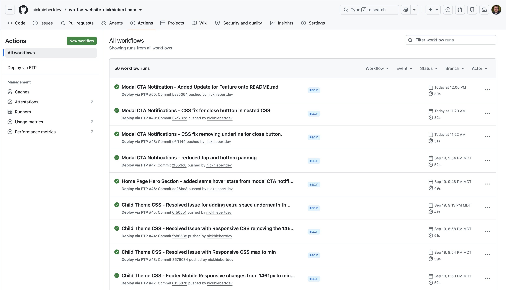
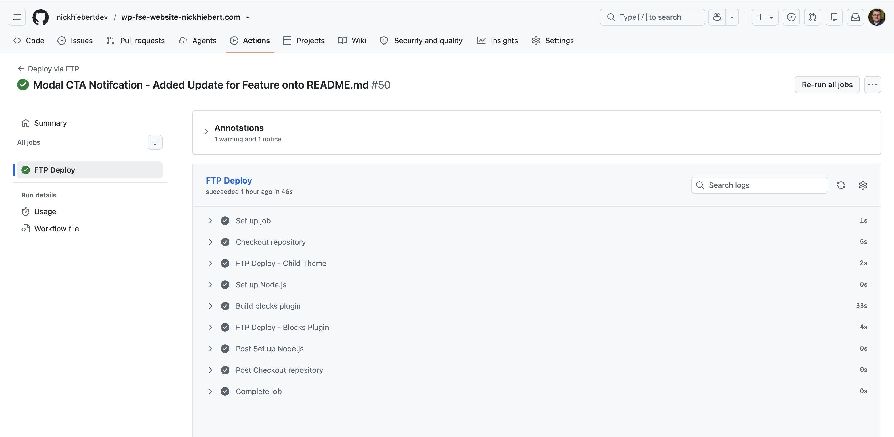
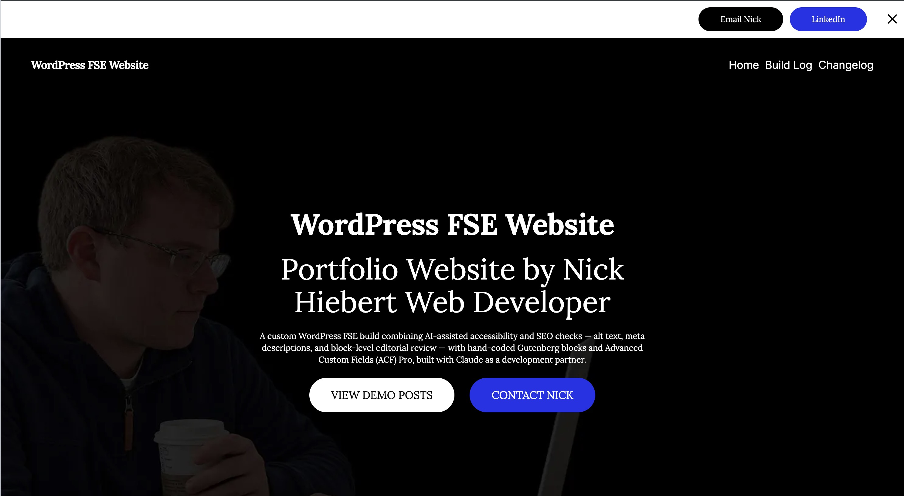
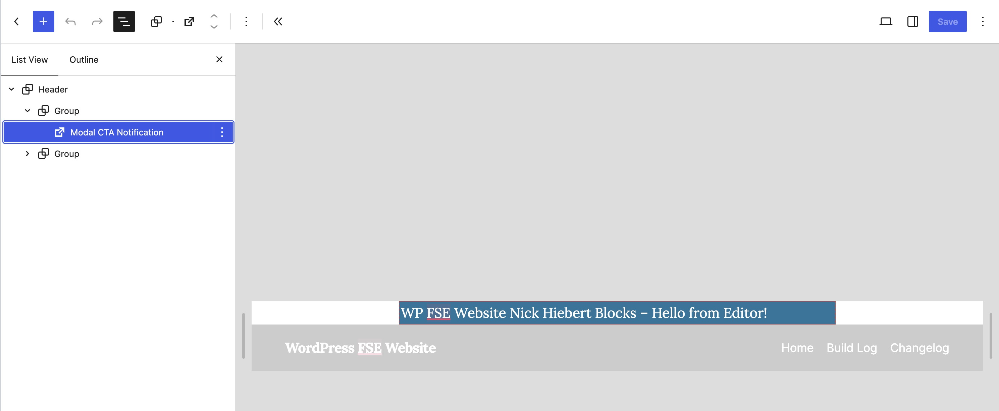
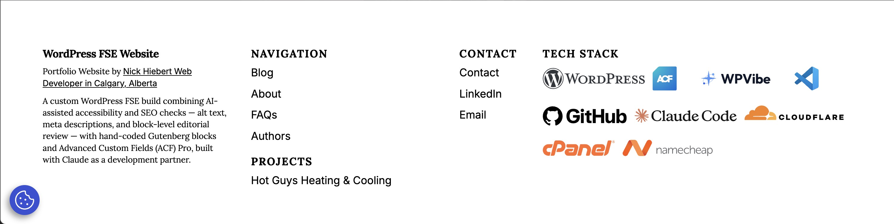
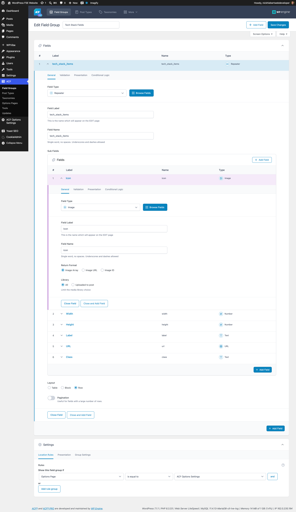
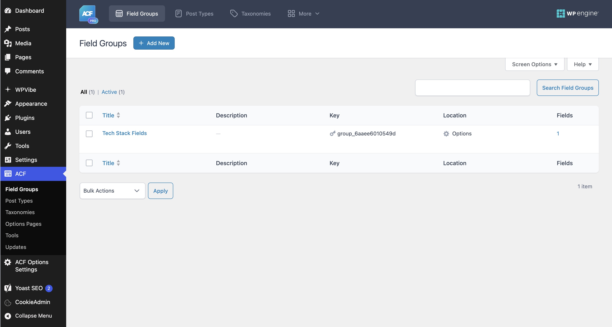
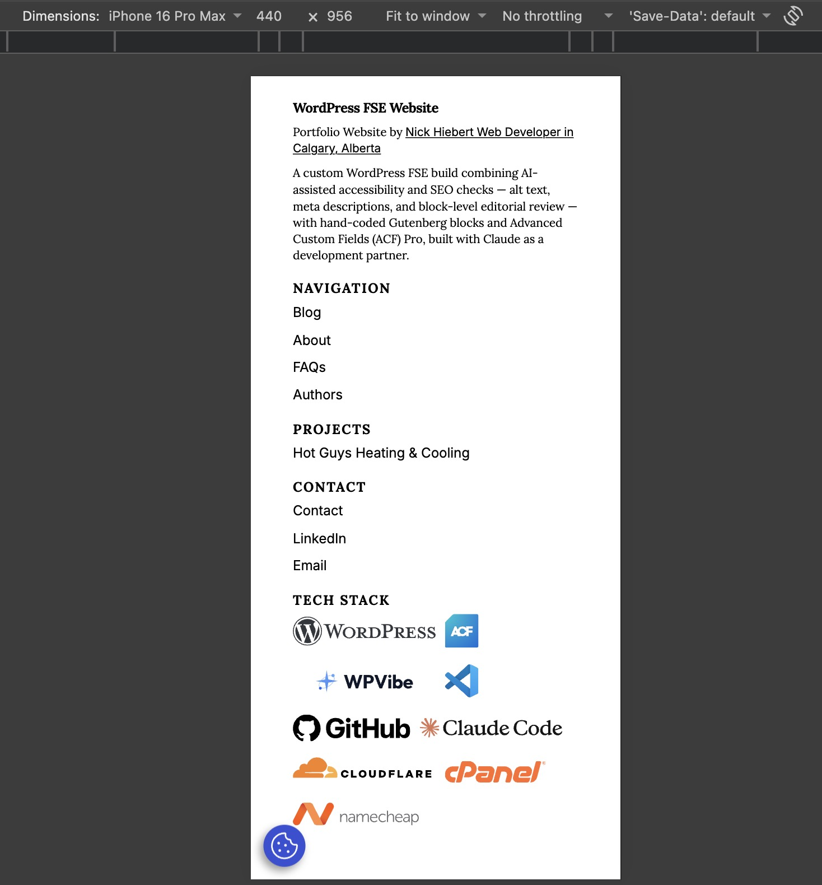
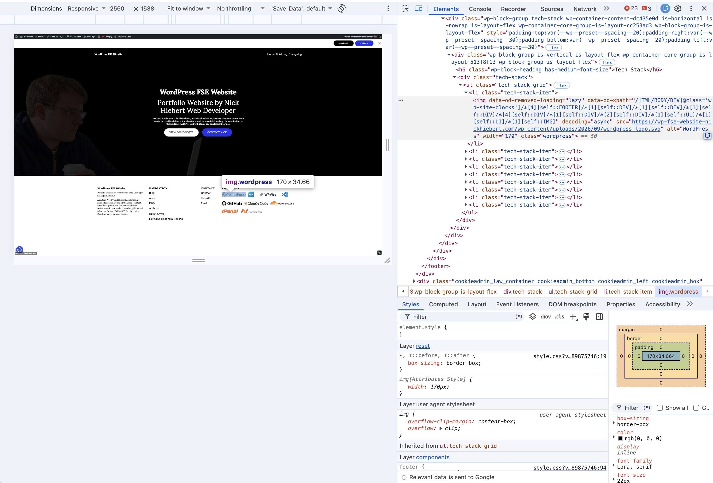

# WordPress Full Site Editing (FSE) Website

A personal WordPress Full Site Editing project used to explore modern block development, from custom Gutenberg blocks with React to a fully automated CI/CD deployment pipeline.

Built and maintained locally in VS Code on a MacBook Pro, with changes tracked in Git and pushed to GitHub. A GitHub Actions pipeline automatically builds and deploys every push straight to the live server, no manual FTP, no manual server side steps.

## Deployment Pipeline - CI/CD with GitHub Actions

Every push to `main` triggers a GitHub Actions workflow that handles both halves of CI/CD. **Continuous Integration** compiles the Gutenberg blocks plugin from source (`npm ci && npm run build`) on a clean runner, so the build is reproducible and never depends on whatever compiled files happened to be committed. **Continuous Deployment** then pushes the built plugin and the child theme straight to the live cPanel server over FTPS. No manual uploads, no dragging files in an FTP client, no server-side git.

Why it matters: the live site is always built from source, not from local artifacts. Only what the server needs ships - `src/` and `node_modules/` are excluded - and each deploy syncs just the changed files. A push-to-live cycle takes under a minute, and the run history doubles as a deploy log.

Getting here took real debugging: the FTP account turned out to be jailed to a subdirectory rather than the site root, so early deploys were silently writing into a phantom folder. The account also requires explicit TLS (FTPES), not plain FTP - which surfaced as a misleading authentication error until it was isolated at the protocol level.

Built with: GitHub Actions, FTPS deploy action, npm, @wordpress/scripts

Source code: [View the workflow](https://github.com/nickhiebertdev/wp-fse-website-nickhiebert.com/blob/main/.github/workflows/deploy.yml)

## Modal CTA Notification - Dismissible Notification CTA Bar with Contact Information

A dismissible notification bar with two calls to action (Email, LinkedIn) and a close button, built as a native Gutenberg block using WordPress's Interactivity API - the same modern, framework-free approach WordPress core uses for its own interactive blocks.

Why it matters: most WordPress "custom blocks" in the wild are either static content or built with older jQuery patterns. This one uses React for the editor experience and the Interactivity API for front-end behavior, with no jQuery and no manual DOM manipulation - the dismiss state is handled declaratively.

Built with: React (JSX), PHP, WordPress Interactivity API, SCSS

Source code: [View the block source](https://github.com/nickhiebertdev/wp-fse-website-nickhiebert.com/tree/main/wp-content/plugins/wp-fse-website-nickhiebert-blocks) - edit.js, index.js, and view.js contain the React/JS logic.

## Tech Stack Logos - Technology Logo Grid with Advanced Custom Fields (ACF)

A responsive row of technology logos in the site footer, fully editable from the WordPress admin. Logos, labels, links, dimensions, and CSS classes are all managed through an Advanced Custom Fields repeater on a global options page, then rendered by a custom shortcode in the child theme.

Why it matters: adding or reordering a technology takes about thirty seconds in wp-admin - no code change, no deploy. The repeater uses one row per technology rather than a fixed set of fields, so the structure scales without touching the field group or the template. Output is escaped per context, uses semantic list markup, sets explicit image dimensions to prevent layout shift, and lazy-loads below the fold.

Built with: PHP, Advanced Custom Fields (ACF Pro), SCSS/CSS cascade layers, Safe SVG

Source code: [View the shortcode source](https://github.com/nickhiebertdev/wp-fse-website-nickhiebert.com/blob/main/wp-content/themes/wp-child-theme-wp-fse-website-nickhiebert/functions.php) - the ACF options page registration and the `[tech_stack]` shortcode are in the child theme's functions.php.

